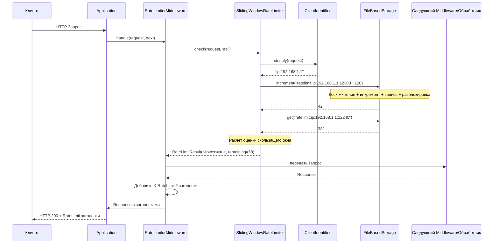
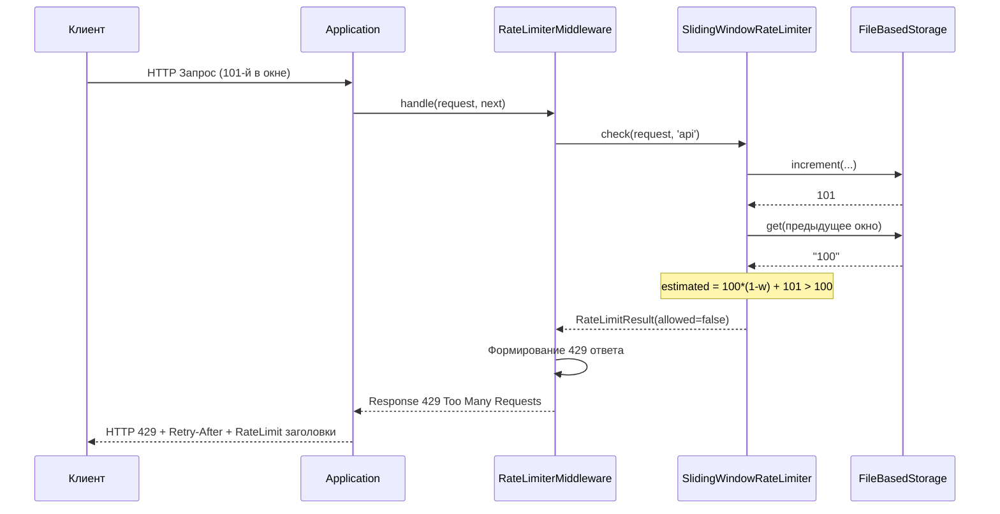
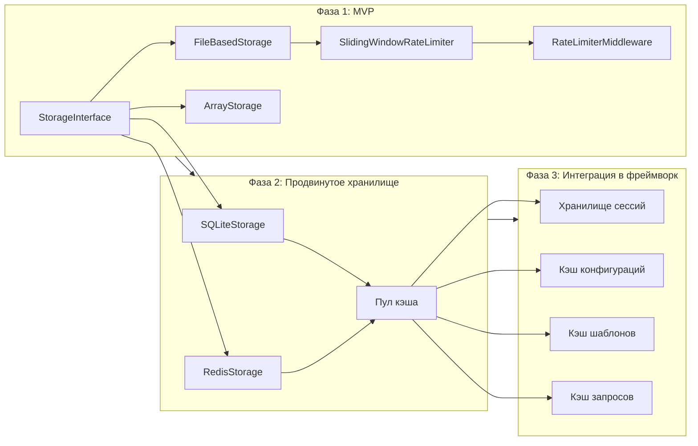

# Архитектура Rate Limiting и Слоя Хранения для фреймворка Joke

## 1. Введение

В этом документе предлагается архитектура системы **Rate Limiting** (ограничения частоты запросов), которая одновременно создаёт **первый универсальный слой хранения (Storage Layer)** во фреймворке Joke. Дизайн следует существующим паттернам фреймворка (Contracts, ConfigurableServiceProvider, MiddlewareInterface, AbstractConfig) и рассчитан на PHP 8.4+ со строгой типизацией.

---

## 2. Выбор технологии: почему файловое хранилище для MVP

### Решение: Файловое хранилище с `flock` + JSON

| Критерий | Файлы (JSON) | SQLite in-memory | SQLite WAL |
|----------|-------------|------------------|------------|
| Нулевые внешние зависимости | ✅ Да | ⚠️ Нужен ext-sqlite3 | ⚠️ Нужен ext-sqlite3 |
| Атомарные операции | ⚠️ Через `flock` | ✅ Через транзакции | ✅ Через транзакции |
| Безопасность в многопроцессной среде | ⚠️ Через `flock` | ✅ | ✅ |
| Производительность (высокая конкурентность) | ⚠️ Средняя | ✅ Хорошая | ✅ Хорошая |
| Прозрачность и отладка | ✅ Обычный JSON | ⚠️ Нужен CLI-инструмент | ⚠️ Нужен CLI-инструмент |
| Сложность реализации | ✅ Низкая | ⚠️ Средняя | ⚠️ Средняя |
| Стоимость запуска | ✅ Нет | ⚠️ Нужно инициализировать схему | ⚠️ Нужно инициализировать схему |

**Победитель: Файловое хранилище с JSON + `flock`**

Обоснование:
1. **Нулевые зависимости** — не требует `ext-sqlite3`, работает на любой установке PHP
2. **Прозрачная отладка** — разработчик может открыть JSON-файл и увидеть все сохранённые ключи
3. **Простая атомарность** — `flock` с `LOCK_EX` обеспечивает безопасный конкурентный доступ для сценария rate limiting
4. **Естественный путь эволюции** — `StorageInterface` позволяет заменить на Redis/SQLite позже без изменения кода приложения
5. **FileRelatedCache уже существует** — фреймворк уже использует файловое кэширование, это согласуется с существующими паттернами

### Когда мигрировать на SQLite/Redis

- **SQLite**: когда нужна лучшая производительность конкурентного чтения и доступен `ext-sqlite3`
- **Redis**: когда приложение работает в распределённой среде (несколько серверов)

---

## 3. Дизайн StorageInterface

### 3.1. Интерфейс

```php
<?php

declare(strict_types=1);

namespace Vasoft\Joke\Contract\Storage;

/**
 * Универсальный интерфейс хранилища ключ-значение с поддержкой TTL.
 *
 * Это фундамент для слоя хранения (Storage Layer) в фреймворке Joke.
 * Реализации: FileDriver, ArrayDriver (для тестов), RedisDriver, SQLiteDriver.
 *
 * Все методы ДОЛЖНЫ быть безопасны для конкурентного доступа из нескольких процессов.
 */
interface StorageInterface
{
    /**
     * Возвращает значение по ключу.
     *
     * @param string $key Уникальный идентификатор
     *
     * @return null|string null, если ключ не найден или истёк срок его жизни
     */
    public function get(string $key): ?string;

    /**
     * Сохраняет значение с опциональным временем жизни.
     *
     * @param string   $key   Уникальный идентификатор
     * @param string   $value Сохраняемое значение
     * @param null|int $ttl   Время жизни в секундах. null = бессрочно
     *
     * @return bool true в случае успеха
     */
    public function set(string $key, string $value, ?int $ttl = null): bool;

    /**
     * Удаляет ключ.
     *
     * @param string $key Уникальный идентификатор
     *
     * @return bool true, если ключ существовал и был удалён
     */
    public function delete(string $key): bool;

    /**
     * Проверяет существование ключа и то, что срок его жизни не истёк.
     *
     * @param string $key Уникальный идентификатор
     */
    public function exists(string $key): bool;

    /**
     * Атомарно увеличивает числовое значение и возвращает новое значение.
     *
     * Если ключ не существует, он создаётся со значением 1.
     * TTL применяется ТОЛЬКО при создании ключа.
     *
     * @param string $key Уникальный идентификатор
     * @param int    $ttl Время жизни в секундах (применяется при создании)
     *
     * @return int Новое значение после инкремента
     */
    public function increment(string $key, int $ttl): int;

    /**
     * Удаляет все истёкшие записи.
     * Опционально — реализации могут выполнять очистку также при чтении.
     *
     * @return int Количество очищенных записей
     */
    public function cleanup(): int;
}
```

### 3.2. Дизайнерские решения

1. **`increment()` атомарен** — это критический метод для rate limiting. Интерфейс гарантирует атомарный инкремент, который файловый драйвер реализует через `flock`.
2. **Значения — строки** — интерфейс хранит строки. Сериализация — ответственность вызывающего кода. Это сохраняет интерфейс минимальным и позволяет хранить сырые данные.
3. **TTL только при создании для increment** — для rate limiting окно TTL устанавливается при запуске счётчика. Последующие инкременты в рамках окна не сбрасывают TTL.

---

## 4. Дизайн RateLimiterInterface

### 4.1. Выбор алгоритма: Sliding Window с фиксированными корзинами

**Почему Sliding Window, а не Token Bucket?**

| Критерий | Token Bucket | Sliding Window (фиксированные корзины) |
|----------|-------------|---------------------------------------|
| Операций хранилища на запрос | 2 (get + set) | 1 (increment + проверка) |
| Требования к атомарности | Read-modify-write | ✅ Один атомарный инкремент |
| Обработка всплесков | ✅ Естественные всплески | ⚠️ Настраивается через размер окна |
| Сложность реализации | Средняя | ✅ Низкая |
| Подходит для файлового хранилища | ⚠️ Нужен read+write | ✅ Одна атомарная операция |

**Победитель: Sliding Window с фиксированными корзинами**

Ключевое преимущество: **Sliding Window с фиксированными корзинами идеально ложится на `increment()`** — одну атомарную операцию. Token Bucket потребовал бы чтения текущего количества токенов, расчёта пополнения и записи обратно — цикл read-modify-write, который сложнее сделать атомарным с файловым хранилищем.

### 4.2. Как работает алгоритм

```
Окно: 60 секунд
Лимит: 100 запросов
Текущее время: T

Формат ключа: "ratelimit:{идентификатор}:{начало_окна}"

Пример для IP 192.168.1.1 при T = 12345:
  Ключ: "ratelimit:192.168.1.1:12300"  (окно начинается в 12300, округлено до 60с)
  TTL: 120 секунд (2x окна для безопасности)

При каждом запросе:
  1. current_window = floor(T / window_size) * window_size
  2. previous_window = current_window - window_size
  3. current_count = storage.increment("ratelimit:{id}:{current_window}", ttl=2*window_size)
  4. previous_count = storage.get("ratelimit:{id}:{previous_window}") ?? 0
  5. weight = (T - current_window) / window_size  // насколько мы в текущем окне
  6. estimated_count = previous_count * (1 - weight) + current_count
  7. если estimated_count > limit → БЛОКИРОВАТЬ
```

Это даёт **точность скользящего окна** с использованием всего:
- 1 атомарный `increment()`
- 1 `get()` (неатомарный, только чтение)

### 4.3. Интерфейс

```php
<?php

declare(strict_types=1);

namespace Vasoft\Joke\Contract\RateLimiter;

use Vasoft\Joke\Http\HttpRequest;

/**
 * Результат проверки лимита частоты запросов.
 */
final readonly class RateLimitResult
{
    /**
     * @param bool   $allowed    Разрешён ли запрос
     * @param int    $remaining  Сколько запросов осталось в текущем окне
     * @param int    $limit      Максимальное количество разрешённых запросов
     * @param int    $resetTime  Unix-метка времени, когда окно сбросится
     * @param string $identifier Идентификатор клиента, использованный для проверки
     */
    public function __construct(
        public bool $allowed,
        public int $remaining,
        public int $limit,
        public int $resetTime,
        public string $identifier,
    ) {}
}

/**
 * Интерфейс идентификатора клиента для Rate Limiter.
 */
interface ClientIdentifierInterface
{
    /**
     * Извлекает уникальный идентификатор клиента из запроса.
     *
     * Примеры:
     * - IP-based: $request->server->getStringOrDefault('REMOTE_ADDR')
     * - User ID-based: $request->props->getString('user_id')
     * - API Key-based: $request->headers->getString('X-API-Key')
     *
     * @param HttpRequest $request Входящий HTTP-запрос
     *
     * @return string Уникальный идентификатор для ограничения частоты запросов
     */
    public function identify(HttpRequest $request): string;
}

/**
 * Интерфейс ограничителя частоты запросов (Rate Limiter).
 */
interface RateLimiterInterface
{
    /**
     * Проверяет, разрешён ли запрос.
     *
     * @param HttpRequest $request  Входящий HTTP-запрос
     * @param string      $ruleName Имя правила лимита (например, 'api', 'login')
     *
     * @return RateLimitResult Результат проверки лимита
     */
    public function check(HttpRequest $request, string $ruleName = 'default'): RateLimitResult;
}
```

---

## 5. Реализация FileBasedStorage

### 5.1. Структура файлов

```
{storagePath}/
  storage.lock        # Глобальный файл блокировки для координации очистки
  data/
    ab/
      ab12cd34...json  # Файл записи (шардирование по хешу)
    cd/
      cd34ef56...json
```

### 5.2. Ключевой дизайн: шардирование по хешу

Каждый ключ хранится в отдельном файле, имя которого — MD5-хеш ключа, с двухуровневым шардированием по директориям:

```
key = "ratelimit:192.168.1.1:12300"
hash = md5(key) = "a1b2c3d4e5f6..."
path = {storage}/data/a1/a1b2c3d4e5f6...json
```

Это предотвращает:
- Слишком много файлов в одной директории
- Коллизии имён
- Path traversal атаки

### 5.3. Формат файла (JSON)

```json
{
    "value": "42",
    "expires_at": 1712345678
}
```

- `expires_at` = Unix-метка времени истечения записи. `null` = бессрочно.
- Файл — это сама запись. Не нужно парсить большой файл для одного ключа.

### 5.4. Атомарный инкремент с `flock`

```php
public function increment(string $key, int $ttl): int
{
    $path = $this->getFilePath($key);
    $dir = dirname($path);

    if (!is_dir($dir)) {
        mkdir($dir, 0755, true);
    }

    $fp = fopen($path, 'c+');
    if (!$fp) {
        throw new StorageException("Не удалось открыть файл: $path");
    }

    // Эксклюзивная блокировка — ожидает освобождения
    flock($fp, LOCK_EX);

    // Чтение текущего содержимого
    $content = stream_get_contents($fp);
    $data = $content ? json_decode($content, true) : null;

    $now = time();

    // Проверка на истечение или отсутствие
    if (null === $data || (isset($data['expires_at']) && $data['expires_at'] <= $now)) {
        $currentValue = 0;
        $expiresAt = $now + $ttl;
    } else {
        $currentValue = (int) $data['value'];
        $expiresAt = $data['expires_at']; // Сохраняем оригинальный срок
    }

    $newValue = $currentValue + 1;

    // Запись обратно
    $newData = json_encode([
        'value' => (string) $newValue,
        'expires_at' => $expiresAt,
    ], JSON_THROW_ON_ERROR);

    // Очистка и перезапись
    ftruncate($fp, 0);
    rewind($fp);
    fwrite($fp, $newData);
    fflush($fp);

    // Снятие блокировки
    flock($fp, LOCK_UN);
    fclose($fp);

    return $newValue;
}
```

### 5.5. Почему `flock` достаточен для Rate Limiting

1. **Rate limiting работает по ключам** — у каждого клиента свой файл. Конкуренция возникает только когда один и тот же клиент отправляет конкурентные запросы.
2. **Короткое время блокировки** — блокировка удерживается только на время чтения + инкремента + записи (микросекунды).
3. **Нет риска взаимоблокировки** — каждый инкремент работает ровно с одним файлом. Нет мультифайловых транзакций.
4. **Совместимость с FPM** — `flock` работает между процессами PHP-FPM, так как они используют общую файловую систему.

---

## 6. Реализация RateLimiter

### 6.1. SlidingWindowRateLimiter

```php
class SlidingWindowRateLimiter implements RateLimiterInterface
{
    public function __construct(
        private readonly StorageInterface $storage,
        private readonly ClientIdentifierInterface $identifier,
        private readonly array $rules = [],
    ) {}

    public function check(HttpRequest $request, string $ruleName = 'default'): RateLimitResult
    {
        $rule = $this->rules[$ruleName] ?? throw new RateLimiterException(
            sprintf('Правило "%s" не найдено', $ruleName),
        );

        $clientId = $this->identifier->identify($request);
        $now = time();
        $windowSize = $rule->windowSize;

        // Текущее окно
        $currentWindow = (int) (floor($now / $windowSize) * $windowSize);
        $currentKey = $this->buildKey($clientId, $currentWindow);

        // Атомарный инкремент счётчика текущего окна
        $currentCount = $this->storage->increment($currentKey, $windowSize * 2);

        // Предыдущее окно (для расчёта скользящего среднего)
        $previousWindow = $currentWindow - $windowSize;
        $previousKey = $this->buildKey($clientId, $previousWindow);
        $previousCount = (int) ($this->storage->get($previousKey) ?? '0');

        // Вес: насколько мы углубились в текущее окно
        $weight = ($now - $currentWindow) / $windowSize;

        // Оценка количества запросов в скользящем окне
        $estimatedCount = (int) ($previousCount * (1 - $weight) + $currentCount);

        $allowed = $estimatedCount <= $rule->limit;
        $remaining = max(0, $rule->limit - $currentCount);
        $resetTime = $currentWindow + $windowSize;

        return new RateLimitResult(
            allowed: $allowed,
            remaining: $remaining,
            limit: $rule->limit,
            resetTime: $resetTime,
            identifier: $clientId,
        );
    }

    private function buildKey(string $clientId, int $windowStart): string
    {
        return sprintf('ratelimit:%s:%d', $clientId, $windowStart);
    }
}
```

### 6.2. Конфигурация правил

```php
final readonly class RuleConfig
{
    public function __construct(
        public int $limit,       // Максимум запросов
        public int $windowSize,  // Размер окна в секундах
        public string $name = 'default',
    ) {}
}
```

---

## 7. Стратегия идентификации клиента

### 7.1. Встроенные реализации

```php
// По IP-адресу (простой, но за NAT все пользователи имеют один IP)
class IpClientIdentifier implements ClientIdentifierInterface
{
    public function identify(HttpRequest $request): string
    {
        return sprintf('ip:%s', $request->server->getStringOrDefault('REMOTE_ADDR', 'unknown'));
    }
}

// IP + User-Agent (лучше для NAT)
class IpWithUserAgentIdentifier implements ClientIdentifierInterface
{
    public function identify(HttpRequest $request): string
    {
        $ip = $request->server->getStringOrDefault('REMOTE_ADDR', 'unknown');
        $ua = $request->headers->getString('User-Agent', '');
        return sprintf('ip:%s:ua:%s', $ip, md5($ua));
    }
}

// По ID авторизованного пользователя
class UserIdClientIdentifier implements ClientIdentifierInterface
{
    public function identify(HttpRequest $request): string
    {
        $userId = $request->props->getString('user_id', '');
        return '' !== $userId ? sprintf('user:%s', $userId) : sprintf('ip:%s', $request->server->getStringOrDefault('REMOTE_ADDR', 'unknown'));
    }
}

// По API-ключу
class ApiKeyClientIdentifier implements ClientIdentifierInterface
{
    public function identify(HttpRequest $request): string
    {
        $apiKey = $request->headers->getString('X-API-Key', '');
        return '' !== $apiKey ? sprintf('apikey:%s', $apiKey) : sprintf('ip:%s', $request->server->getStringOrDefault('REMOTE_ADDR', 'unknown'));
    }
}

// Цепочка: перебор стратегий по порядку
class ChainClientIdentifier implements ClientIdentifierInterface
{
    /** @param ClientIdentifierInterface[] $identifiers */
    public function __construct(private readonly array $identifiers) {}

    public function identify(HttpRequest $request): string
    {
        foreach ($this->identifiers as $identifier) {
            $result = $identifier->identify($request);
            if (!str_starts_with($result, 'ip:unknown')) {
                return $result;
            }
        }
        return 'ip:unknown';
    }
}
```

---

## 8. Интеграция Middleware

### 8.1. RateLimiterMiddleware

```php
class RateLimiterMiddleware implements MiddlewareInterface
{
    public function __construct(
        private readonly RateLimiterInterface $rateLimiter,
        private readonly ResponseBuilder $responseBuilder,
        private readonly RateLimiterConfig $config,
    ) {}

    public function handle(HttpRequest $request, callable $next): Response
    {
        $ruleName = $this->resolveRule($request);

        $result = $this->rateLimiter->check($request, $ruleName);

        if (!$result->allowed) {
            return $this->buildRateLimitResponse($result);
        }

        $response = $next($request);
        $preparedResponse = $this->responseBuilder->make($response);

        // Добавление заголовков лимита
        $preparedResponse->headers
            ->set('X-RateLimit-Limit', (string) $result->limit)
            ->set('X-RateLimit-Remaining', (string) $result->remaining)
            ->set('X-RateLimit-Reset', (string) $result->resetTime);

        return $preparedResponse;
    }

    private function resolveRule(HttpRequest $request): string
    {
        $path = $request->getPath();
        foreach ($this->config->rules as $name => $rule) {
            if ('' !== $name && 'default' !== $name && str_starts_with($path, '/' . $name)) {
                return $name;
            }
        }
        return 'default';
    }

    private function buildRateLimitResponse(RateLimitResult $result): Response
    {
        $response = $this->responseBuilder->makeDefault();
        $response->setStatus(ResponseStatus::TOO_MANY_REQUESTS);
        $response->headers
            ->set('Retry-After', (string) ($result->resetTime - time()))
            ->set('X-RateLimit-Limit', (string) $result->limit)
            ->set('X-RateLimit-Remaining', '0')
            ->set('X-RateLimit-Reset', (string) $result->resetTime);

        return $response;
    }
}
```

### 8.2. Схема взаимодействия



### 8.3. Сценарий превышения лимита



---

## 9. Регистрация через Service Provider

### 9.1. RateLimiterServiceProvider

```php
class RateLimiterServiceProvider extends AbstractProvider implements ConfigurableServiceProviderInterface
{
    public function __construct(
        private readonly ServiceContainer $serviceContainer,
    ) {}

    public function register(): void
    {
        $this->serviceContainer->registerSingleton(StorageInterface::class, FileBasedStorage::class);
        $this->serviceContainer->registerSingleton(ClientIdentifierInterface::class, IpClientIdentifier::class);
        $this->serviceContainer->registerSingleton(RateLimiterInterface::class, SlidingWindowRateLimiter::class);
    }

    public function boot(): void
    {
        $routeMiddlewares = $this->serviceContainer->get('middleware.route');
        $routeMiddlewares->addMiddleware(
            RateLimiterMiddleware::class,
            StdMiddleware::RATE_LIMITER->value,
        );
    }

    public function provides(): array
    {
        return [
            StorageInterface::class,
            ClientIdentifierInterface::class,
            RateLimiterInterface::class,
        ];
    }

    public static function provideConfigs(): array
    {
        return [RateLimiterConfig::class];
    }

    public static function buildConfig(string $configClass, ServiceContainer $container): AbstractConfig
    {
        return match ($configClass) {
            RateLimiterConfig::class => new RateLimiterConfig(),
            default => throw new UnknownConfigException($configClass),
        };
    }
}
```

### 9.2. Конфигурация (config/ratelimiter.php)

```php
<?php

declare(strict_types=1);

use Vasoft\Joke\RateLimiter\RateLimiterConfig;
use Vasoft\Joke\RateLimiter\ClientIdentifier\IpClientIdentifier;

return (new RateLimiterConfig())
    ->setStoragePath(__DIR__ . '/../storage/ratelimit')
    ->setRules([
        'default' => ['limit' => 100, 'window' => 60],
        'api' => ['limit' => 1000, 'window' => 3600],
        'login' => ['limit' => 5, 'window' => 60],
    ])
    ->setClientIdentifierClass(IpClientIdentifier::class);
```

### 9.3. Динамическая конфигурация (без перезагрузки сервера)

`RateLimiterConfig` загружается заново при каждом запросе через `ConfigManager`. Чтобы изменить лимиты:

1. **Изменить файл конфигурации** — изменения вступают в силу со следующим запросом (без кэша)
2. **Переменные окружения** — `RATE_LIMIT_API=2000` может переопределить файловую конфигурацию
3. **В будущем: административная панель** — хранить правила в том же `StorageInterface` и проверять при каждом запросе

---

## 10. Структура директорий

```
src/
  Contract/
    Storage/
      StorageInterface.php
    RateLimiter/
      RateLimiterInterface.php
      ClientIdentifierInterface.php
      RateLimitResult.php
  Storage/
    FileBasedStorage.php
    ArrayStorage.php              # Для тестов
    Exceptions/
      StorageException.php
  RateLimiter/
    RuleConfig.php
    RateLimiterConfig.php
    SlidingWindowRateLimiter.php
    ClientIdentifier/
      IpClientIdentifier.php
      IpWithUserAgentIdentifier.php
      UserIdClientIdentifier.php
      ApiKeyClientIdentifier.php
      ChainClientIdentifier.php
    Middleware/
      RateLimiterMiddleware.php
    Provider/
      RateLimiterServiceProvider.php
    Exceptions/
      RateLimiterException.php
```

---

## 11. Стратегия тестирования с ArrayStorage

`ArrayStorage` — это in-memory реализация `StorageInterface`, предназначенная для тестов. Она:
- Не требует файловой системы
- Поддерживает инъекцию времени (`setTime()`) для детерминированных тестов
- Все операции атомарны в рамках одного процесса

```php
class ArrayStorage implements StorageInterface
{
    /** @var array<string, array{value: string, expires_at: ?int}> */
    private array $data = [];
    private int $time;

    public function __construct(?int $now = null)
    {
        $this->time = $now ?? time();
    }

    public function get(string $key): ?string { /* ... */ }
    public function set(string $key, string $value, ?int $ttl = null): bool { /* ... */ }
    public function delete(string $key): bool { /* ... */ }
    public function exists(string $key): bool { /* ... */ }
    public function increment(string $key, int $ttl): int { /* ... */ }
    public function cleanup(): int { /* ... */ }
    public function setTime(int $time): void { $this->time = $time; }
}
```

---

## 12. Сводка ключевых архитектурных решений

| Решение | Выбор | Обоснование |
|---------|-------|-------------|
| Бэкенд хранилища | Файловый (JSON + flock) | Нулевые зависимости, отлаживаемость, простая атомарность |
| Алгоритм | Sliding Window с фиксированными корзинами | Один атомарный инкремент, нет read-modify-write |
| Механизм атомарности | `flock(LOCK_EX)` | Работает между процессами FPM, блокировка по ключу |
| Идентификация клиента | Паттерн Strategy через `ClientIdentifierInterface` | Легко расширяется, компонуется в цепочку |
| Конфигурация | `AbstractConfig` + `ConfigurableServiceProvider` | Следует существующим паттернам фреймворка |
| Динамическая перенастройка | Перезагрузка файла конфигурации на каждый запрос | Не требует перезапуска сервера |
| Тестируемость | `ArrayStorage` драйвер | Быстрый, детерминированный, инъекция времени |

---

## 13. Путь эволюции



---

## 14. Граничные случаи и обработка ошибок

1. **Директория хранилища недоступна для записи** → `StorageException` с понятным сообщением
2. **Диск переполнен** → `StorageException` перехватывается `ExceptionMiddleware` → ответ 500
3. **Конкурентная очистка** → Очистка использует глобальный lock-файл; если блокировка не удалась, пропускаем
4. **Рассинхронизация часов** → Все метки времени серверные (`time()`). Время клиента не используется.
5. **Первый запрос** → `increment()` создаёт файл со значением 1 и TTL
6. **Ключ со спецсимволами** → MD5-хеш устраняет проблемы с путями
7. **Высокий трафик одного клиента** → Блокируется только файл этого клиента; остальные не затронуты
8. **Отрицательный TTL** → Защита в `increment()`: `$ttl = max(1, $ttl)`